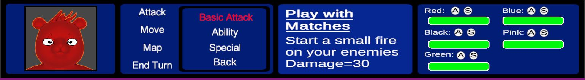
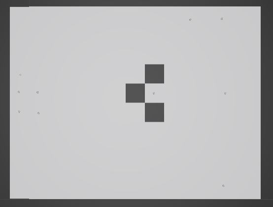
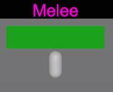
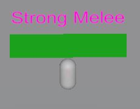
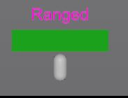
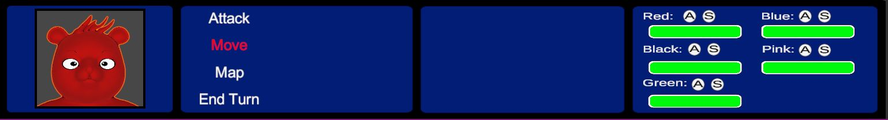
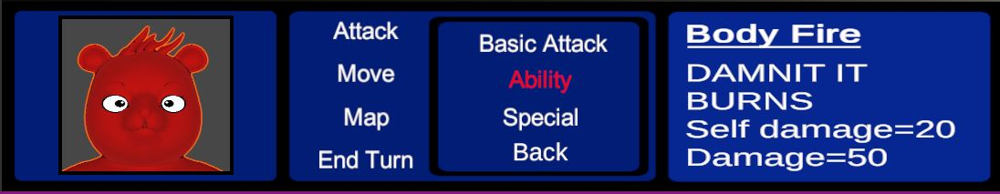

**DropBears**

**Overview:**

        Our Team has decided to do a turn-based tactical strategy game. We came up with DropBears, where you play as a squad of different colored bears that each have their own unique abilities fighting for justice and honey.

**Gameplay:**

The objective of the game is simple, defeat the enemy team before your team is wiped out.

| Character Icon | Battle Menu and ATTACK Submenu | Attack Information | Character Statuses |
| --- | --- | --- | --- |
| This panel will display the selected character. | This panel will display the gameplay options. (Explained Below) | This panel will display the information of the different attack option in the submenu. | This panel displays the current health of the player characters and has indicators to show if the abilities are usable. |

 

**Map:**

The placeholder battle map: 

- The Map is divided into squares.
- Grey Squares = Can be interacted with
- Dark Grey Squares = Obstacles (cannot            be interacted with and will block movement)

**Player Characters:**

| DropBear Squad | Squad Stats | BasicAttack | Ability | Special |
| --- | --- | --- | --- | --- |
|

 | HP = 100Defense = 7Attack = 30Movement = 3Attack Range = 3 | Play with Matches:  Deals 30 Damage. | Body Fire: Deals 50 damagedeals 20 self-damage. | Energize: Let an ally use their special again. |
|

 | HP = 100Defense = 7Attack = 40Movement = 3Attack Range = 3 | Black Lightning: Deals 40 damage. | Beef Up: Basic Attack Up 1.5x (One Turn) | Drive By: Deals 60 Damage. |
|

 | HP = 100Defense = 7Attack = 40Movement = 5Attack Range = 5 | Blue Balls: Deals 40 Damage. | Gotta Go Fast: Gives Ally +2Movement(One Turn). | Power Strike: Deals 50 Damage. |
|

 | HP = 150Defense = 10Attack = 30Movement = 2Attack Range = 2 | Skull Smash: Deals 30 damage. | Hunker Down Defence x2(One Turn). | Juggernaut Become Invicible(One Turn). |
|

 | HP = 150Defense = 5Attack = 30Movement = 3Attack Range = 4 | Love Beam: Deals 30 damage. | Heal: Heals 40 HP | Resurrect: Fully Heal or revive ally. |

**Enemies:**

| Enemy Types | Stats | Basic Attack |
| --- | --- | --- |
|
 

 | HP = 80Defense = 5Attack = 20Movement = 3Attack Range = 1 |   Deals 20 damage. |
|
 

 | HP = 140Defense = 9Attack = 35Movement = 4Attack Range = 1 |   Deals 35 damage.  |
|
 

 | HP = 70Defense = 3Attack = 35Movement = 4Attack Range = 3 |   Deals 35 damage. |

**Instructions/Controls:**

**Navigating the Menu:**

 

AD/Left and Right Arrow Keys – Switch characters.

WS/Up and Down Arrow Keys –Navigate up or down in the Menu.

Enter/Spacebar – Confirm the Selection.

Backspace – Return to previous menu

Esc – Pause the game.

**Attack:**

 

The attack option brings up a submenu with the specific bears different abilities:

- Basic Attack - Deals regular damage which is based on the bears attack strength.
- Ability - Each Bear has an ability that can deal extra damage to an enemy or buff one of the stats of itself or another bear. (Once used it has a 3 turn cooldown)
- Special -  Same as ability but stronger. (Can only be used once per battle).

 

Once an option has been selected you will be moved to the map and the range of the attack will be displayed in red.

Controls:

WASD/Arrow Keys – Navigate the cursor (Pink Square) and select a tile with an enemy.

SpaceBar/Enter – Confirm Selection

**Move:**

 

Once move has been selected you will be moved to the map and the range of your movement will be displayed in blue.

Controls:

WASD/Arrow Keys – Navigate the cursor (Pink Square) and select a tile to move too.

SpaceBar/Enter – Confirm Selection

**Map (Not Implemented Yet):**

This option will allow you to look around the map to see enemy locations and obstacles.

**End Turn:**

Once you have finished with a character you must end their turn individually to continue.

**Resources:**

**Bear Model** - 3D cartoon bear by visnum - [https://www.turbosquid.com/3d-models/3d-bear-cartoon-1240541](https://www.turbosquid.com/3d-models/3d-bear-cartoon-1240541)
**SkyBoxes**
Unity Asset Store
https://assetstore.unity.com/packages/2d/textures-materials/sky/8k-skybox-pack-free-150926
**CampFire Pack**
DreamDev Studio
https://assetstore.unity.com/packages/3d/environments/fantasy/campfire-pack-11256
**PolyGon Knights Package**
SynTy Studios
https://assetstore.unity.com/packages/3d/environments/fantasy/polygon-knights-pack-83694

Everything else used so far – Built in Unity Assets.
Scripting help from unity resources
